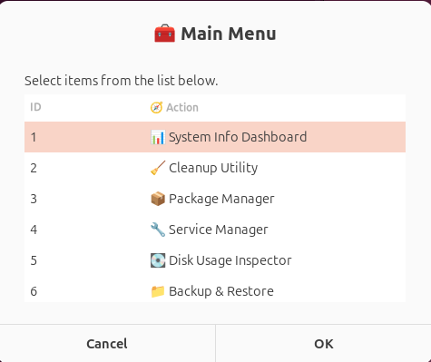

# 🧰 Linux System Maintenance ToolKit

A simple, user-friendly **Zenity-based GUI tool** for performing essential system maintenance tasks on Linux.

> Built using **Bash scripting** and **Zenity dialogs** to provide a point-and-click interface for sysadmins and users.

---

## 🚀 Features

- 🖥️ **System Info Dashboard**
- 🧹 **Cleanup Utility** – Clear cache, clean `/tmp`, journal logs, etc.
- 📦 **Package Manager** – Update, upgrade, autoremove, and view installed packages
- 🔧 **Service Manager** – Start, stop, restart, and check service statuses
- 💾 **Disk Usage Inspector** – Inspect disk space, partitions, large files
- 🗄️ **Backup & Restore** – Create `.tar.gz` backups and restore them easily
- 🖱️ **Zenity GUI Menus** – No terminal commands required

---

## 🧰 Tech Stack

| Category       | Tech Stack |
|----------------|------------|
| **Core**       | Bash       |
| **GUI Layer**  | Zenity     |
| **Platform**   | Linux      |

---

## 📸 Screenshot

> 🧰 A preview of the **Toolkit Main Menu** powered by Zenity:

<p align="center">
  
  <br><strong>🖱️ Main Menu Dialog</strong>
</p>

---

## 📁 Folder Structure

```
├── index.sh
├── modules/
│ ├── backup.sh
│ ├── cleanup.sh
│ ├── disk.sh
│ ├── info.sh
│ ├── packages.sh
│ └── service.sh
├── assets/
│ └── (UI screenshots)
├── .gitignore
└── README.md
```

---

## ⚙️ Getting Started

### 1. Clone the Repository

```bash
git clone https://github.com/yash-kumarsharma/Linux-System-Maintenance-ToolKit.git
cd Linux-System-Maintenance-ToolKit
```

### 2. Make the scripts executable
```bash
chmod +x index.sh modules/*.sh
```

### 3. Run the Toolkit
```bash
./index.sh
```

✅ Requires Zenity installed. If not already present:
```bash
sudo apt install zenity
```

---

## 💡 Usage
-Run index.sh to launch the main menu.

-Select a task to run its respective GUI tool.

-Logs are temporarily stored in /tmp and cleaned on reboot.

---

## 👨‍💻 Made By
Created with 🐧 and ⚙️ by:

[](https://github.com/yash-kumarsharma)
[](https://github.com/SinghPrabhnoor)

⭐ Star this repo if it helped you keep your system clean and efficient!
